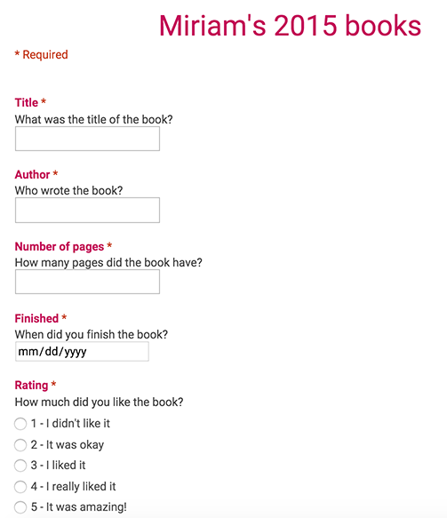

```{r setup, include=FALSE}
knitr::opts_chunk$set(dev="png", dev.args=list(type="cairo"), dpi=150)

library(magrittr)
library(dplyr)
library(readr)
library(tidyr)
library(lubridate)
library(stringr)
library(ggplot2)
library(scales)
library(grid)
library(gridExtra)

# Colors
single.color <- "#FE4365"
break.color <- "#FF851B"
school.color <- "#85144B"

# ------------
# Break data
# ------------
# Data frame of actual breaks
break.dates <- data_frame(start = ymd(c('2015-03-28', '2015-06-12', 
                                      '2015-09-26', '2015-12-19')), 
                          end = ymd(c('2015-04-12', '2015-07-19', 
                                    '2015-10-18', '2015-12-31')))
breaks.intervals <- (break.dates %>% mutate(x=new_interval(start, end)))$x

# Bands to add to time series plots
breaks.rect <- geom_rect(data=break.dates, aes(x=NULL, y=NULL, xmin=start, 
                                               xmax=end, ymin=0, ymax=+Inf), 
                         fill=break.color, alpha=0.4)

# Data frame of full year, marking if day was a break
full.year <- data.frame(day = seq(ymd('2015-01-01'), ymd('2015-12-31'), by='days')) %>%
  group_by(day) %>%
  mutate(in.break = any(day %within% breaks.intervals))

# Summarize proporition of each month on break
breaks.month <- full.year %>%
  mutate(month = month(day, label=TRUE, abbr=FALSE)) %>%
  group_by(month) %>%
  summarize(perc.break = sum(in.break) / n(),
            school.break = ifelse(perc.break > 0.3, TRUE, FALSE))

# Summarize proporition of each week on break
breaks.week <- full.year %>%
  mutate(week = week(day)) %>%
  group_by(week) %>%
  summarize(perc.break = sum(in.break) / n(),
            school.break = ifelse(perc.break > 0.3, TRUE, FALSE))


# -----------
# Book data
# -----------
# Load book data
url <- "https://docs.google.com/spreadsheets/d/1yeXgxg038qUInqrbYF-uy-nFoOlDwvKiD4L9dYQyPC0/"
csv_url <- paste0(url, "export?format=csv")

rating.labels <- c("I didn't like it", "It was okay", "I liked it", 
                   "I really liked it", "It was amazing!")

books <- read_csv(csv_url) %>%
  mutate(Timestamp = mdy_hms(Timestamp),
         Finished = mdy(Finished),
         Rating = as.numeric(substr(Rating, 1, 1)),
         Rating.factor = factor(Rating, levels=1:5, labels=rating.labels, ordered=TRUE),
         Title = str_to_title(str_trim(Title)),
         Title.factor = factor(Title),
         Author = str_to_title(str_trim(Author)),
         Author.factor = factor(Author)) %>%
  rename(Pages = `Number of pages`) %>%
  mutate(day.month = day(Finished),
         day.year = yday(Finished),
         week = week(Finished),
         day.factor = factor(day.month, ordered=TRUE),
         day.year.factor = factor(day.year, ordered=TRUE),
         week.factor = factor(week, ordered=TRUE),
         weekday = wday(Finished, label=TRUE, abbr=FALSE),
         month = month(Finished, label=TRUE, abbr=FALSE)) %>%
  arrange(day.year) %>%
  mutate(total.pages = cumsum(Pages),
         total.books = 1:n())

# Summary by month
books.month <- books %>%
  group_by(month) %>%
  summarize(num.books = n(),
            num.pages = sum(Pages),
            avg.pages = mean(Pages)) %>%
  left_join(breaks.month, by="month")

# Summary by week
books.week <- books %>%
  group_by(week) %>%
  summarize(num.books = n(),
            num.pages = sum(Pages),
            avg.pages = mean(Pages)) %>%
  left_join(breaks.week, by="week") %>%
  mutate(week.date = as.POSIXct(paste("2015", week-1, "7"), 
                           format="%Y %U %u", tz="GMT"))
books.week[1,]$week.date <- ymd('2014-12-30', tz="GMT")  # Adjust first week


# ------------------
# Useful functions
# ------------------
# Tufte-esque theme (add white hlines as needed)
theme_clean <- function(base_size=12, base_family="Source Sans Pro Light") {
  ret <- theme_bw(base_size, base_family) + 
    theme(panel.background = element_rect(fill="#ffffff", colour=NA),
          axis.title.x=element_text(vjust=-0.2), axis.title.y=element_text(vjust=1.5),
          title=element_text(vjust=1.2, family="Source Sans Pro Semibold"),
          panel.border = element_blank(), axis.line=element_blank(),
          panel.grid=element_blank(), axis.ticks=element_blank(),
          legend.position="none", 
          axis.title=element_text(size=rel(0.8), family="Source Sans Pro Semibold"),
          strip.text=element_text(size=rel(1), family="Source Sans Pro Semibold"),
          strip.background=element_rect(fill="#ffffff", colour=NA),
          panel.margin.y=unit(1.5, "lines"))
  
  ret
}

clean.t <- function(test) { 
  sprintf("*t* (%.2f) = %.2f, *p* = %.3f", 
        test$parameter, test$statistic, test$p.value)
}
```

Since we've had so much fun tracking all the books Rachel read in [2014](http://www.heissatopia.com/2014/12/rachels-2014-reading-report.html) and [2015](http://www.heissatopia.com/2015/12/rachels-2015-reading-report.html), this year Miriam decided to join in. At the beginning of the year, Miriam decided to read 100 books—an ambitious goal considering she was still in the middle of preschool and was only dreaming of kindergarten. After a few months, though, she realized that 100 books was too easy, so she changed it to 200 (twice as ambitious!). Because we put a sort of data dashboard on the desktop of our media computer, she was able to track how far ahead of Rachel she was throughout most of the year (and delighted in reminding Rachel that she'd read more books than her).

Starting kindergarten in July (and skipping to 1st grade in August), though, was rough on her—probably a little more difficult than we thought now that we can see the data. As you'll see below, she curtailed her reading significantly once school started and has only recently (i.e. just this week) returned to pre-1st-grade levels (albeit with much more difficult books now). 

Here's how great she did this year:


# Data and methods

Copying the system that Rachel's been using, I set up a Google Form where Miriam could type in the title, author, 5-point rating, and number of pages in each book as she finished, as well as the date of completion.



It's hard to type in books immediately after finishing them, so we had a regular backlog of books to be recorded. Just like Rachel, the day of the week is almost always wrong but the weeks are generally correct, so all the analysis is limited to a week or month level.


# Results

As always, the [raw data](`r url`) and [code](https://github.com/andrewheiss/2015-book-reports) are all available online if you want to follow along. You can [read this on our family blog](http://www.heissatopia.com/2015/12/miriams-2015-reading-report.html) too.

## Summary statistics

```{r summary, echo=FALSE, results='hide'}
num.books <- nrow(books)
num.pages <- sum(books$Pages)

longest <- books %>% filter(Pages == max(Pages))
```

Miriam read `r prettyNum(num.pages, big.mark=",")` pages of `r num.books` books in 2015. On average, each book was `r round(mean(books$Pages), 0)` pages long. The clear majority of books were under 100 pages (thanks to the [*Rainbow Magic* series by Daisy Meadows](https://en.wikipedia.org/wiki/Rainbow_Magic) and [*The Magic Tree House* series by Mary Pope Osborne](https://en.wikipedia.org/wiki/Magic_Tree_House_(series))). Miriam did read some longer books, though, including Harry Potter 1 and 2 and the first three books in the *Little House* series (the longest book she read was one of these: the `r longest$Pages`-page *`r longest$Title`*).

```{r page_hist, echo=FALSE, fig.width=6, fig.height=3.5, warning=FALSE}
ggplot(books, aes(x=Pages)) +
  geom_histogram(binwidth=25, fill=single.color, colour="white") + 
  scale_x_continuous(breaks=seq(0, 400, 100)) + 
  geom_hline(yintercept=seq(25, 100, by=25), size=0.25, colour="white") + 
  labs(x="Pages", y="Frequency", title="Length of books read in 2015") + 
  theme_clean()
```

```{r author_summary, echo=FALSE, results='hide'}
authors.ordered <- sort(table(books$Author.factor), decreasing=TRUE)
authors.reversed <- sort(table(books$Author.factor))
top.authors <- authors.ordered[1:15]

num.authors <- length(authors.ordered)
books.by.top <- sum(top.authors)
```

Miriam read books by only `r num.authors` different authors. She adored the *Rainbow Magic* and *The Magic Tree House* series (so much that we had to ban her from checking out the fairy books from the library in August). Once we stopped fairies and tree houses—and after some convincing—Miriam fell in love with Nancy Drew and also started to branch out to other books and authors. `r round(books.by.top / num.books * 100)`% of the books she read were written by only 15 authors; an astonishing `r round(authors.ordered[1] / num.books * 100)`% were written by Daisy Meadows (!). 

```{r top_authors, echo=FALSE, fig.width=6, fig.height=3.5, warning=FALSE}
author.plot.data <- books %>%
  filter(Author %in% names(top.authors)) %>%
  arrange(desc(Author.factor)) %>%
  mutate(Author.factor = factor(Author.factor, ordered=TRUE, 
                                levels=names(authors.reversed)))

ggplot(author.plot.data, aes(x=Author.factor)) + 
  geom_bar(fill=single.color) + 
  labs(x=NULL, y="Books by author", title="Repeat authors in 2015") + 
  geom_hline(yintercept=seq(20, 80, by=20), size=0.25, colour="white") + 
  coord_flip() + 
  theme_clean()
```

```{r rating_summary, echo=FALSE, results='hide'}
plot.ratings <- books %>%
  group_by(Rating.factor) %>%
  summarise(num = n()) %>%
  ungroup() %>%
  mutate(prop = num / sum(num)) %>%
  # Merge with all possible levels in case of empty levels
  right_join(expand.grid(Rating.factor = levels(books$Rating.factor)),
             by="Rating.factor")

books.hated <- books %>% filter(Rating == 1)
pct.loved <- filter(plot.ratings, Rating.factor == "It was amazing!")$prop
pct.liked <- filter(plot.ratings, Rating.factor == "I really liked it")$prop
```

This year I asked the girls to rate the books they read, based on a 5-point scale I borrowed/stole from [Goodreads](https://www.goodreads.com): 1 = I didn't like it; 2 = It was okay; 3 = I liked it; 4 = I really liked it; 5 = It was amazing!. Miriam was a little better at getting variation in her ratings (Rachel rated pretty much everything as 5)—she thought `r prettyNum(round(pct.loved * 100, 0))`% of her books were amazing and really like `r prettyNum(round(pct.liked * 100, 0))`% of them. She only disliked two books (both from the *Junie B. Jones* series). She hated one of those—*Junie B. Jones and the Stupid Smelly Bus*—because it had the word "stupid" in the title. She says that if not for that title, it would have been a 3 or a 4. 

```{r ratings, echo=FALSE, fig.width=6, fig.height=3, warning=FALSE}
ggplot(plot.ratings, aes(x=Rating.factor, y=num)) + 
  geom_bar(stat="identity", fill=single.color) + 
  labs(x=NULL, y="Books", title="Book ratings in 2015") + 
  geom_hline(yintercept=seq(25, 100, by=25), size=0.25, colour="white") + 
  coord_flip() + 
  theme_clean()
```

## Trends over time

```{r books_pages_over_time, echo=FALSE, results='hide'}
# Convert to long for plotting
books.month.long <- books.month %>% 
  gather(variable, number, c(num.books, num.pages)) %>%
  mutate(variable = factor(variable, labels=c("Books", "Pages")))

books.week.long <- books.week %>% 
  gather(variable, number, c(num.books, num.pages)) %>%
  mutate(variable = factor(variable, labels=c("Books", "Pages")))

# Create data frame for horizontal lines
month.hline <- data.frame(lines=seq(10, 30, by=10), variable="Books") %>%
  rbind(., data.frame(lines=seq(1000, 3000, by=1000), variable="Pages"))

week.hline <- data.frame(lines=seq(2.5, 10, by=2.5), variable="Books") %>%
  rbind(., data.frame(lines=seq(300, 900, by=300), variable="Pages"))

# General stats
pages.per.month <- mean(books.month$num.pages)
books.per.month <- mean(books.month$num.books)

pages.per.week <- mean(books.week$num.pages)
books.per.week <- mean(books.week$num.books)

break.diff.books <- t.test(num.books ~ school.break, data=books.week)
break.diff.pages <- t.test(num.pages~ school.break, data=books.week)

slowest.month <- filter(books.month, month == "January")$num.books
```

Looking at how Miriam read throughout the year also shows some interesting patterns. It took a while for her to get started—she only read `r slowest.month` books in January, her slowest month. After that, though, she was a monster and read 20-30 books a month. Once school started, though, she slowed down considerably—skipping kindergarten and dealing with 1st grade apparently had some negative effects. In August she started a sort of unconscious reading boycott and would either go to sleep right away (skipping reading time) or start a book and never finish it (sometimes with only 4 pages left). Nancy's theory is that she was afraid of a literary [#showhole](https://www.youtube.com/watch?v=kdj9k4jsw-c) and didn't want the book to end.

On average she read around `r prettyNum(round(books.per.month, 0), big.mark=",")` books and around `r prettyNum(signif(pages.per.month, 2), big.mark=",")` pages each month, or `r prettyNum(round(books.per.week, 0), big.mark=",")` books and around `r prettyNum(signif(pages.per.week, 2), big.mark=",")` pages every week.

```{r books_pages_month, echo=FALSE, fig.width=11, fig.height=6, warning=FALSE}
ggplot(books.month.long, aes(x=month, y=number)) + 
  geom_bar(aes(fill=school.break), stat="identity") + 
  labs(x=NULL, y=NULL) + 
  ggtitle(expression(atop("Books and pages read in 2015 (by month)", 
                          atop("Months with more than 30% time off school colored orange"), ""))) +
  scale_fill_manual(values=c(school.color, break.color)) + 
  scale_y_continuous(labels=comma, expand=c(0, 0)) + 
  scale_x_discrete(expand=c(0, 0)) + 
  facet_wrap(~ variable, ncol=1, scales="free_y") + 
  geom_hline(data=month.hline, aes(yintercept=lines), size=0.25, colour="white") + 
  theme_clean()
```

Weekly data gives a more granular look at these trends. Notably, there are a few weeks where Miriam didn't read anything at all—the first few weeks of the year, a week in May, the first week of school, and the week of Christmas. She found new motivation to read after Christmas, though, and has been reading like a maniac this week.

```{r books_pages_week, echo=FALSE, fig.width=11, fig.height=6, warning=FALSE}
ggplot(books.week.long, aes(x=week.date, y=number)) + 
  geom_bar(aes(fill=school.break), stat="identity") + 
  labs(x=NULL, y=NULL) + 
  ggtitle(expression(atop("Books and pages read in 2015 (by week)", 
                          atop("Weeks with more than 30% time off school colored orange"), ""))) +
  scale_fill_manual(values=c(school.color, break.color)) + 
  scale_y_continuous(labels=comma, expand=c(0, 0)) +
  scale_x_datetime(breaks=date_breaks("1 month"), 
                   labels=date_format("%B"), expand=c(0, 0)) + 
  facet_wrap(~ variable, ncol=1, scales="free_y") + 
  geom_hline(data=week.hline, aes(yintercept=lines), size=0.25, colour="white") + 
  theme_clean()
```

As with Rachel, though it initially seems that she read more during breaks from school, there's no statistically significant difference between the average number of books and pages in weeks in school and on break (books: `r clean.t(break.diff.books)`; pages: `r clean.t(break.diff.pages)`).

```{r books_pages_violin, echo=FALSE, fig.width=6, fig.height=2.5, warning=FALSE}
break.plot <- books.week %>%
  mutate(school.break = factor(school.break, labels=c("In school", "On break")))

pages.violin <- ggplot(break.plot, aes(x=school.break, y=num.pages)) + 
  geom_violin(aes(fill=school.break), alpha=0.2) + 
  geom_point(aes(colour=school.break), alpha=0.3) + 
  geom_point(aes(colour=school.break), stat="summary", fun.y="mean", size=5) + 
  scale_fill_manual(values=c(school.color, break.color)) + 
  scale_colour_manual(values=c(school.color, break.color)) + 
  labs(x=NULL, y="Pages per week") + 
  coord_flip() + theme_clean()

books.violin <- ggplot(break.plot, aes(x=school.break, y=num.books)) + 
  geom_violin(aes(fill=school.break), alpha=0.2) + 
  geom_point(aes(colour=school.break), alpha=0.3) + 
  geom_point(aes(colour=school.break), stat="summary", fun.y="mean", size=5) + 
  scale_fill_manual(values=c(school.color, break.color)) + 
  scale_colour_manual(values=c(school.color, break.color)) + 
  labs(x=NULL, y="Books per week") + 
  coord_flip() + theme_clean()

fig.violin <- arrangeGrob(books.violin, pages.violin, nrow=2)
grid.draw(fig.violin)
```

In general, Miriam read longer books as the year progressed—though she started reading less often once school started in July, her average book length increased slightly in the second half of the year.

```{r books_scatter, echo=FALSE, fig.width=7, fig.height=4.5, warning=FALSE}
ggplot(books, aes(x=Finished, y=Pages)) +
  breaks.rect + 
  geom_point(size=2, alpha=0.6) + 
  geom_smooth(method="loess", colour=single.color, fill=single.color) + 
  scale_colour_manual(values=c("grey40", "#D95B43")) + 
  scale_x_datetime(labels=date_format("%B")) +
  scale_y_continuous(expand=c(0, 15)) + 
  labs(x=NULL, y="Pages") + 
  ggtitle(expression(atop("Books read in 2015 by length", 
                          atop("School breaks shaded in organge"), ""))) +
  theme_clean()
```

```{r cum_stats, echo=FALSE, results='hide'}
first.goal <- filter(books, total.books == 100)$Finished
second.goal <- filter(books, total.books == 200)$Finished
```

Finally, Miriam's original goal was to read 100 books, but in April she realized how fast she could get there (thanks, again, to her love of the fairy books), so she changed it to 200. The figure below shows the cumulative number of books she read during year. The pink reference line shows what she had to do to reach 200 books by the end of the year; the dotted grey line shows her average trend (one book every `r round(365 / num.books, 2)` days). She hit her 100-book goal on `r format(first.goal, "%B %e")` and her 200-book goal on `r format(second.goal, "%B %e")`. 

```{r cumulative_plot, echo=FALSE, fig.width=7, fig.height=4.5, warning=FALSE}
reference.line <- data.frame(Finished=ymd(c('2015-01-01', '2015-12-31')), 
                             total.books=c(0, 200))

ggplot(books, aes(x=Finished, y=total.books)) + 
  breaks.rect + 
  stat_smooth(method="lm", se=FALSE, colour="grey70", 
              size=0.5, alpha=0.5, linetype=2) +  # Trend
  geom_line(data=reference.line, colour=single.color, size=0.5) +  # Reference line
  geom_line(color=school.color, size=1) +  # Actual cumulative books
  geom_hline(yintercept=100, linetype=3, size=0.5, colour="grey70") + 
  geom_hline(yintercept=200, linetype=3, size=0.5, colour="grey70") + 
  geom_rug(sides="b", alpha=0.5, colour="grey40") + 
  scale_x_datetime(labels=date_format("%B")) + 
  labs(x=NULL, y="Cumulative number of books") + 
  ggtitle(expression(atop("Progress throughout 2015", 
                          atop("School breaks shaded in orange"), ""))) +
  coord_cartesian(ylim=c(0, 250)) + 
  theme_clean()
```

# Conclusion

So, in 2015, Miriam read `r num.books` books that, in general, were `r round(mean(books$Pages), 0)` pages long. According to [Wolfram Alpha](http://www.wolframalpha.com/input/?i=`r num.pages`+pages), it would take an auctioneer 29 days to read all `r prettyNum(num.pages, big.mark=",")` pages out loud (48 days for mere mortals). Phew.

We're so proud of how much Miriam grew and learned this year!
