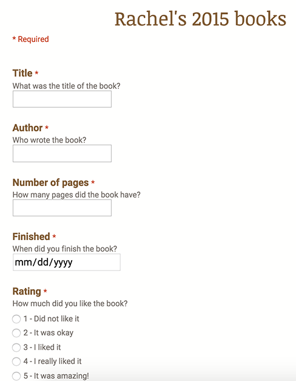

```{r setup, include=FALSE}
knitr::opts_chunk$set(dev="png", dev.args=list(type="cairo"), dpi=150)

library(magrittr)
library(dplyr)
library(readr)
library(tidyr)
library(lubridate)
library(stringr)
library(ggplot2)
library(scales)
library(grid)
library(gridExtra)

# Colors
single.color <- "#208A70"
break.color <- "#FF851B"
school.color <- "#85144B"

# ------------
# Break data
# ------------
# Data frame of actual breaks
break.dates <- data_frame(start = ymd(c('2015-03-28', '2015-06-12', 
                                      '2015-09-26', '2015-12-19')), 
                          end = ymd(c('2015-04-12', '2015-07-19', 
                                    '2015-10-18', '2015-12-31')))
breaks.intervals <- (break.dates %>% mutate(x=new_interval(start, end)))$x

# Bands to add to time series plots
breaks.rect <- geom_rect(data=break.dates, aes(x=NULL, y=NULL, xmin=start, 
                                               xmax=end, ymin=0, ymax=+Inf), 
                         fill=break.color, alpha=0.4)

# Data frame of full year, marking if day was a break
full.year <- data.frame(day = seq(ymd('2015-01-01'), ymd('2015-12-31'), by='days')) %>%
  group_by(day) %>%
  mutate(in.break = any(day %within% breaks.intervals))

# Summarize proporition of each month on break
breaks.month <- full.year %>%
  mutate(month = month(day, label=TRUE, abbr=FALSE)) %>%
  group_by(month) %>%
  summarize(perc.break = sum(in.break) / n(),
            school.break = ifelse(perc.break > 0.3, TRUE, FALSE))

# Summarize proporition of each week on break
breaks.week <- full.year %>%
  mutate(week = week(day)) %>%
  group_by(week) %>%
  summarize(perc.break = sum(in.break) / n(),
            school.break = ifelse(perc.break > 0.3, TRUE, FALSE))


# -----------
# Book data
# -----------
# Load book data
url <- "https://docs.google.com/spreadsheets/d/1GvxMTnBehXaguLcHQpQBO8WQkg95vD2xAVfMMCYyi7o/"
csv_url <- paste0(url, "export?format=csv")

rating.labels <- c("I didn't like it", "It was okay", "I liked it", 
                   "I really liked it", "It was amazing!")

books <- read_csv(csv_url) %>%
  mutate(Timestamp = mdy_hms(Timestamp),
         Finished = mdy(Finished),
         Rating = as.numeric(substr(Rating, 1, 1)),
         Rating.factor = factor(Rating, levels=1:5, labels=rating.labels, ordered=TRUE),
         Title = str_to_title(str_trim(Title)),
         Title.factor = factor(Title),
         Author = str_to_title(str_trim(Author)),
         Author.factor = factor(Author)) %>%
  rename(Pages = `Number of pages`) %>%
  mutate(day.month = day(Finished),
         day.year = yday(Finished),
         week = week(Finished),
         day.factor = factor(day.month, ordered=TRUE),
         day.year.factor = factor(day.year, ordered=TRUE),
         week.factor = factor(week, ordered=TRUE),
         weekday = wday(Finished, label=TRUE, abbr=FALSE),
         month = month(Finished, label=TRUE, abbr=FALSE)) %>%
  arrange(day.year) %>%
  mutate(total.pages = cumsum(Pages),
         total.books = 1:n())

# Summary by month
books.month <- books %>%
  group_by(month) %>%
  summarize(num.books = n(),
            num.pages = sum(Pages),
            avg.pages = mean(Pages)) %>%
  left_join(breaks.month, by="month")

# Summary by week
books.week <- books %>%
  group_by(week) %>%
  summarize(num.books = n(),
            num.pages = sum(Pages),
            avg.pages = mean(Pages)) %>%
  left_join(breaks.week, by="week") %>%
  mutate(week.date = as.POSIXct(paste("2015", week-1, "7"), 
                           format="%Y %U %u", tz="GMT"))
books.week[1,]$week.date <- ymd('2014-12-30', tz="GMT")  # Adjust first week


# ------------------
# Useful functions
# ------------------
pct.change <- function(num.old, num.new) {
  change <- num.new - num.old
  return(change / num.old)
}

# Tufte-esque theme (add white hlines as needed)
theme_clean <- function(base_size=12, base_family="Source Sans Pro Light") {
  ret <- theme_bw(base_size, base_family) + 
    theme(panel.background = element_rect(fill="#ffffff", colour=NA),
          axis.title.x=element_text(vjust=-0.2), axis.title.y=element_text(vjust=1.5),
          title=element_text(vjust=1.2, family="Source Sans Pro Semibold"),
          panel.border = element_blank(), axis.line=element_blank(),
          panel.grid=element_blank(), axis.ticks=element_blank(),
          legend.position="none", 
          axis.title=element_text(size=rel(0.8), family="Source Sans Pro Semibold"),
          strip.text=element_text(size=rel(1), family="Source Sans Pro Semibold"),
          strip.background=element_rect(fill="#ffffff", colour=NA),
          panel.margin.y=unit(1.5, "lines"))
  
  ret
}

clean.t <- function(test) { 
  sprintf("*t* (%.2f) = %.2f, *p* = %.3f", 
        test$parameter, test$statistic, test$p.value)
}
```

Continuing our tradition of quantifying and measuring all our children's achievements, we once again tracked every book Rachel read this year. At the beginning of the year she decided to set a goal of 400 books ([given her success last year at reading 382 books](http://www.heissatopia.com/2014/12/rachels-2014-reading-report.html)). However, we didn't take into account the fact that the books she reads now are longer and more complex—she started 2014 reading 60-page Junie B. Jones and Cam Jansen books that she could fly through. She's also taken to Doctor Who and spent nearly Friday night—and most evenings during school breaks—watching an episode or two (she finished all nine seasons from the modern show and has watched most of the older episodes available on Netflix). Because of that (and because we never got around to revising her goal), she didn't come anywhere close to 400. But that's totally okay because she read a ton of fantastic books this year and Doctor Who totally counts as literary acculturation so it's all good.

Here's how she did.


# Data and methods

Like last year, I set up a Google Form where Rachel could type in the title, author, and number of pages in each book as she finished, as well as the date of completion. I also added a field for her to rate each of the books on a 5-point scale (more on that later).



Again, like last year, we tried to get her to type in the books as she finished them, but we had a perpetual pile of books by the media computer waiting to be recorded. Accordingly, the dates for each book are not entirely accurate. The day of the week is almost always wrong but the weeks are generally correct, so all the analysis is limited to a week or month level.


# Results

The [raw data](`r url`) and [code](https://github.com/andrewheiss/2015-book-reports) are all available online if you want to follow along.

## Summary statistics

```{r summary, echo=FALSE, results='hide'}
num.books <- nrow(books)
num.pages <- sum(books$Pages)

books.2014 <- 382
pages.2014 <- 72041
page.avg.2014 <- 188.589

longest <- books %>% filter(Pages == max(Pages))

change.books <- pct.change(books.2014, num.books)
change.pages <- pct.change(pages.2014, num.pages)
change.avg <- pct.change(page.avg.2014, mean(books$Pages))
```


Rachel read `r prettyNum(num.pages, big.mark=",")` pages of `r num.books` books in 2015, considerably less than last year's `r prettyNum(pages.2014, big.mark=",")` pages and `r books.2014` books. (`r abs(round(change.pages * 100, 0))`% fewer pages and `r abs(round(change.books * 100))`% fewer books). On average, each book was `r round(mean(books$Pages), 0)` pages long, which is considerably larger than last year (`r abs(round(change.avg * 100))`% higher), meaning that she read longer books this year. The majority of books were between 150 and 400 pages, with some clusters around 150, 300, and 400 pages (perhaps because publishers aim for those lengths?). Like last year, the longest book she read was *`r longest$Title`*, which was `r longest$Pages` pages long.

```{r page_hist, echo=FALSE, fig.width=6, fig.height=3.5, warning=FALSE}
ggplot(books, aes(x=Pages)) +
  geom_histogram(binwidth=25, fill=single.color, colour="white") + 
  scale_x_continuous(breaks=seq(0, 900, 100)) + 
  geom_hline(yintercept=seq(5, 25, by=5), size=0.25, colour="white") + 
  labs(x="Pages", y="Frequency", title="Length of books read in 2015") + 
  theme_clean()
```

```{r author_summary, echo=FALSE, results='hide'}
authors.ordered <- sort(table(books$Author.factor), decreasing=TRUE)
authors.reversed <- sort(table(books$Author.factor))
top.authors <- authors.ordered[1:15]

num.authors <- length(authors.ordered)
books.by.top <- sum(top.authors)
```

Rachel read books by `r num.authors` different authors, but as with last year, Rachel was a fan of certain authors and would try to read whole series at a time—we regularly had to convince her that standalone books were okay too. In fact, 15 authors wrote half of all the books she read this year. While J. K. Rowling was her clear favorite last year, this year Rachel read books by Lemony Snicket (*Series of Unfortunate Events*, twice), Carolyn Keene (*Nancy Drew*), R. L. Stine (*Goosebumps*), and Cressida Cowell (*How to Train Your Dragon*), among others.

```{r top_authors, echo=FALSE, fig.width=6, fig.height=3.5, warning=FALSE}
author.plot.data <- books %>%
  filter(Author %in% names(top.authors)) %>%
  arrange(desc(Author.factor)) %>%
  mutate(Author.factor = factor(Author.factor, ordered=TRUE, 
                                levels=names(authors.reversed)))

ggplot(author.plot.data, aes(x=Author.factor)) + 
  geom_bar(fill=single.color) + 
  labs(x=NULL, y="Books by author", title="Repeat authors in 2015") + 
  geom_hline(yintercept=seq(5, 20, by=5), size=0.25, colour="white") + 
  coord_flip() + 
  theme_clean()
```

Last year I manually calculated the [Lexile](https://www.lexile.com/) score for each book, but I didn't have the time or energy to do that this year. Plus it didn't really reveal that much. She's reading hard books—she read *The Fellowship of the Rings* in May, for example. That's good enough.

```{r rating_summary, echo=FALSE, results='hide'}
plot.ratings <- books %>%
  group_by(Rating.factor) %>%
  summarise(num = n()) %>%
  ungroup() %>%
  mutate(prop = num / sum(num)) %>%
  # Merge with all possible levels in case of empty levels
  right_join(expand.grid(Rating.factor = levels(books$Rating.factor)),
             by="Rating.factor")

books.hated <- books %>% filter(Rating == 1) %>% slice(1)
pct.loved <- filter(plot.ratings, Rating.factor == "It was amazing!")$prop
```

This year I asked the girls to rate the books they read, based on a 5-point scale I borrowed/stole from [Goodreads](https://www.goodreads.com): 1 = I didn't like it; 2 = It was okay; 3 = I liked it; 4 = I really liked it; 5 = It was amazing!. Rachel either wasn't really good at rating books, or she *really* thought that `r prettyNum(round(pct.loved * 100, 0))`% of the books she read were amazing. She only disliked one book: `r books.hated$Author`'s *`r books.hated$Title`*. 

```{r ratings, echo=FALSE, fig.width=6, fig.height=3, warning=FALSE}
ggplot(plot.ratings, aes(x=Rating.factor, y=num)) + 
  geom_bar(stat="identity", fill=single.color) + 
  labs(x=NULL, y="Books", title="Book ratings in 2015") + 
  geom_hline(yintercept=seq(50, 200, by=50), size=0.25, colour="white") + 
  coord_flip() + 
  theme_clean()
```

## Trends over time

```{r books_pages_over_time, echo=FALSE, results='hide'}
# Convert to long for plotting
books.month.long <- books.month %>% 
  gather(variable, number, c(num.books, num.pages)) %>%
  mutate(variable = factor(variable, labels=c("Books", "Pages")))

books.week.long <- books.week %>% 
  gather(variable, number, c(num.books, num.pages)) %>%
  mutate(variable = factor(variable, labels=c("Books", "Pages")))

# Create data frame for horizontal lines
month.hline <- data.frame(lines=seq(10, 30, by=10), variable="Books") %>%
  rbind(., data.frame(lines=seq(2000, 8000, by=2000), variable="Pages"))

week.hline <- data.frame(lines=seq(5, 15, by=5), variable="Books") %>%
  rbind(., data.frame(lines=seq(1000, 3000, by=1000), variable="Pages"))

# General stats
pages.per.month <- mean(books.month$num.pages)
books.per.month <- mean(books.month$num.books)

pages.per.week <- mean(books.week$num.pages)
books.per.week <- mean(books.week$num.books)

break.diff.books <- t.test(num.books ~ school.break, data=books.week)
break.diff.pages <- t.test(num.pages~ school.break, data=books.week)
```

Looking at how Rachel read throughout the year also shows some interesting patterns. The amount she read was not very stable—she only read 9 books in May (one was *Fellowship of the Rings*, which probably explains the slowdown), while reading around 30 in July, November, and December (July because of our huge road trip, December because of Christmas break, and November because… reasons?). On average she read around `r prettyNum(round(books.per.month, 0), big.mark=",")` books and around `r prettyNum(signif(pages.per.month, 2), big.mark=",")` pages each month, or `r prettyNum(round(books.per.week, 0), big.mark=",")` books and around `r prettyNum(signif(pages.per.week, 2), big.mark=",")` pages every week.

```{r books_pages_month, echo=FALSE, fig.width=11, fig.height=6, warning=FALSE}
ggplot(books.month.long, aes(x=month, y=number)) + 
  geom_bar(aes(fill=school.break), stat="identity") + 
  labs(x=NULL, y=NULL) + 
  ggtitle(expression(atop("Books and pages read in 2015 (by month)", 
                          atop("Months with more than 30% time off school colored orange"), ""))) +
  scale_fill_manual(values=c(school.color, break.color)) + 
  scale_y_continuous(labels=comma, expand=c(0, 0)) + 
  scale_x_discrete(expand=c(0, 0)) + 
  facet_wrap(~ variable, ncol=1, scales="free_y") + 
  geom_hline(data=month.hline, aes(yintercept=lines), size=0.25, colour="white") + 
  theme_clean()
```

Weekly data gives a more granular look at these trends. Notably, there are a few weeks where Rachel didn't read anything at all. *Lord of the Rings* killed pretty much all reading in May, and early fall was inexplicably hard on reading.

```{r books_pages_week, echo=FALSE, fig.width=11, fig.height=6, warning=FALSE}
ggplot(books.week.long, aes(x=week.date, y=number)) + 
  geom_bar(aes(fill=school.break), stat="identity") + 
  labs(x=NULL, y=NULL) + 
  ggtitle(expression(atop("Books and pages read in 2015 (by week)", 
                          atop("Weeks with more than 30% time off school colored orange"), ""))) +
  scale_fill_manual(values=c(school.color, break.color)) + 
  scale_y_continuous(labels=comma, expand=c(0, 0)) +
  scale_x_datetime(breaks=date_breaks("1 month"), 
                   labels=date_format("%B"), expand=c(0, 0)) + 
  facet_wrap(~ variable, ncol=1, scales="free_y") + 
  geom_hline(data=week.hline, aes(yintercept=lines), size=0.25, colour="white") + 
  theme_clean()
```

Though it seems that she read more during breaks from school, the difference between the average number of books and pages in weeks in school and on break is not statistically significant (books: `r clean.t(break.diff.books)`; pages: `r clean.t(break.diff.pages)`).

```{r books_pages_violin, echo=FALSE, fig.width=6, fig.height=2.5, warning=FALSE}
break.plot <- books.week %>%
  mutate(school.break = factor(school.break, labels=c("In school", "On break")))

pages.violin <- ggplot(break.plot, aes(x=school.break, y=num.pages)) + 
  geom_violin(aes(fill=school.break), alpha=0.2) + 
  geom_point(aes(colour=school.break), alpha=0.3) + 
  geom_point(aes(colour=school.break), stat="summary", fun.y="mean", size=5) + 
  scale_fill_manual(values=c(school.color, break.color)) + 
  scale_colour_manual(values=c(school.color, break.color)) + 
  labs(x=NULL, y="Pages per week") + 
  coord_flip() + theme_clean()

books.violin <- ggplot(break.plot, aes(x=school.break, y=num.books)) + 
  geom_violin(aes(fill=school.break), alpha=0.2) + 
  geom_point(aes(colour=school.break), alpha=0.3) + 
  geom_point(aes(colour=school.break), stat="summary", fun.y="mean", size=5) + 
  scale_fill_manual(values=c(school.color, break.color)) + 
  scale_colour_manual(values=c(school.color, break.color)) + 
  labs(x=NULL, y="Books per week") + 
  coord_flip() + theme_clean()

fig.violin <- arrangeGrob(books.violin, pages.violin, nrow=2)
grid.draw(fig.violin)
```

It would be cool to see which days of the week she read the most, but like last year, we were all lazy and didn't always put in the correct day. Oops.

In general, Rachel didn't read longer books as the year progressed (contrary to her Harry Potter-fueled mid-summer bump last year)—book length remained relatively constant throughout the year and wasn't really correlated with school breaks.

```{r books_scatter, echo=FALSE, fig.width=7, fig.height=4.5, warning=FALSE}
ggplot(books, aes(x=Finished, y=Pages)) +
  breaks.rect + 
  geom_point(size=2, alpha=0.6) + 
  geom_smooth(method="loess", colour=single.color, fill=single.color) + 
  scale_colour_manual(values=c("grey40", "#D95B43")) + 
  scale_x_datetime(labels=date_format("%B")) +
  scale_y_continuous(expand=c(0, 15)) + 
  labs(x=NULL, y="Pages") + 
  ggtitle(expression(atop("Books read in 2015 by length", 
                          atop("School breaks shaded in organge"), ""))) +
  theme_clean()
```

Finally, Rachel's original goal was to read 400 books, but it was too ambitious and she was never on track to actually meet it (and she never got around to revising it). The figure below shows the cumulative number of books she read during year. The green reference line shows what she would have had to do to reach 400 books by the end of the year; the dotted grey line shows her average trend (one book every `r round(365 / num.books, 2)` days)

```{r cumulative_plot, echo=FALSE, fig.width=7, fig.height=4.5, warning=FALSE}
reference.line <- data.frame(Finished=ymd(c('2015-01-01', '2015-12-31')), 
                             total.books=c(0, 400))

ggplot(books, aes(x=Finished, y=total.books)) + 
  breaks.rect + 
  stat_smooth(method="lm", se=FALSE, colour="grey70", 
              size=0.5, alpha=0.5, linetype=2) +  # Trend
  geom_line(data=reference.line, colour=single.color, size=0.5) +  # Reference line
  geom_line(color=school.color, size=1) +  # Actual cumulative books
  geom_rug(sides="b", alpha=0.5, colour="grey40") + 
  scale_x_datetime(labels=date_format("%B")) + 
  labs(x=NULL, y="Cumulative number of books") + 
  ggtitle(expression(atop("Progress throughout 2015", 
                          atop("School breaks shaded in orange"), ""))) +
  coord_cartesian(ylim=c(0, 250)) + 
  theme_clean()
```

# Conclusion

So, in 2015, Rachel read `r num.books` books that, in general, were `r round(mean(books$Pages), 0)` pages long. According to [Wolfram Alpha](http://www.wolframalpha.com/input/?i=`r num.pages`+pages), it would take 71 days of silent reading to read all `r prettyNum(num.pages, big.mark=",")` pages (full 24-hour days; no breaks for eating or sleeping!). That means she spent almost 20% of her year reading. Crazy.

We're so impressed with all of this and proud of Rachel! Who knows what she'll try (and what we'll track) next year.
